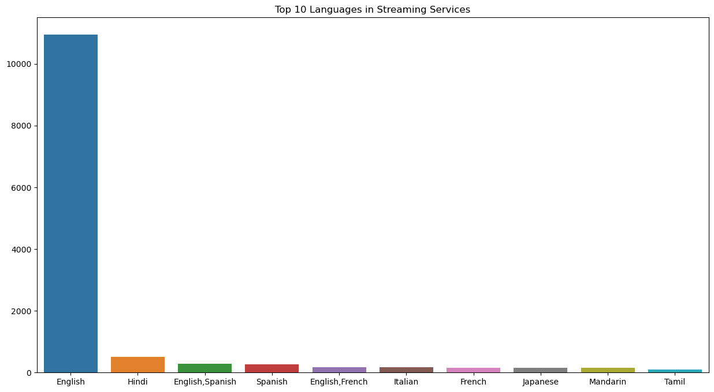
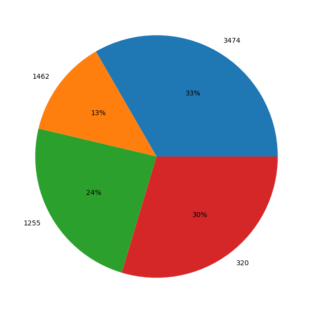

```python
import numpy as np
import matplotlib.pyplot as plt
import seaborn as sns
import pandas as pd
import plotly.io as pyo
pyo.renderers.default='iframe'
import plotly.express as px
%matplotlib inline
```


```python
df = pd.read_csv('moviestreams.csv')
df.head()
```


<div>
<style scoped>
    .dataframe tbody tr th:only-of-type {
        vertical-align: middle;
    }

    .dataframe tbody tr th {
        vertical-align: top;
    }

    .dataframe thead th {
        text-align: right;
    }
</style>
<table border="1" class="dataframe">
  <thead>
    <tr style="text-align: right;">
      <th></th>
      <th>Unnamed: 0</th>
      <th>ID</th>
      <th>Title</th>
      <th>Year</th>
      <th>Age</th>
      <th>IMDb</th>
      <th>Rotten Tomatoes</th>
      <th>Netflix</th>
      <th>Hulu</th>
      <th>Prime Video</th>
      <th>Disney+</th>
      <th>Type</th>
      <th>Directors</th>
      <th>Genres</th>
      <th>Country</th>
      <th>Language</th>
      <th>Runtime</th>
    </tr>
  </thead>
  <tbody>
    <tr>
      <th>0</th>
      <td>0</td>
      <td>1</td>
      <td>Inception</td>
      <td>2010</td>
      <td>13+</td>
      <td>8.8</td>
      <td>87%</td>
      <td>1</td>
      <td>0</td>
      <td>0</td>
      <td>0</td>
      <td>0</td>
      <td>Christopher Nolan</td>
      <td>Action,Adventure,Sci-Fi,Thriller</td>
      <td>United States,United Kingdom</td>
      <td>English,Japanese,French</td>
      <td>148.0</td>
    </tr>
    <tr>
      <th>1</th>
      <td>1</td>
      <td>2</td>
      <td>The Matrix</td>
      <td>1999</td>
      <td>18+</td>
      <td>8.7</td>
      <td>87%</td>
      <td>1</td>
      <td>0</td>
      <td>0</td>
      <td>0</td>
      <td>0</td>
      <td>Lana Wachowski,Lilly Wachowski</td>
      <td>Action,Sci-Fi</td>
      <td>United States</td>
      <td>English</td>
      <td>136.0</td>
    </tr>
    <tr>
      <th>2</th>
      <td>2</td>
      <td>3</td>
      <td>Avengers: Infinity War</td>
      <td>2018</td>
      <td>13+</td>
      <td>8.5</td>
      <td>84%</td>
      <td>1</td>
      <td>0</td>
      <td>0</td>
      <td>0</td>
      <td>0</td>
      <td>Anthony Russo,Joe Russo</td>
      <td>Action,Adventure,Sci-Fi</td>
      <td>United States</td>
      <td>English</td>
      <td>149.0</td>
    </tr>
    <tr>
      <th>3</th>
      <td>3</td>
      <td>4</td>
      <td>Back to the Future</td>
      <td>1985</td>
      <td>7+</td>
      <td>8.5</td>
      <td>96%</td>
      <td>1</td>
      <td>0</td>
      <td>0</td>
      <td>0</td>
      <td>0</td>
      <td>Robert Zemeckis</td>
      <td>Adventure,Comedy,Sci-Fi</td>
      <td>United States</td>
      <td>English</td>
      <td>116.0</td>
    </tr>
    <tr>
      <th>4</th>
      <td>4</td>
      <td>5</td>
      <td>The Good, the Bad and the Ugly</td>
      <td>1966</td>
      <td>18+</td>
      <td>8.8</td>
      <td>97%</td>
      <td>1</td>
      <td>0</td>
      <td>1</td>
      <td>0</td>
      <td>0</td>
      <td>Sergio Leone</td>
      <td>Western</td>
      <td>Italy,Spain,West Germany</td>
      <td>Italian</td>
      <td>161.0</td>
    </tr>
  </tbody>
</table>
</div>


```python
df.shape
```


    (16744, 17)


```python
cols = df.columns.tolist()
cols
```


    ['Unnamed: 0',
     'ID',
     'Title',
     'Year',
     'Age',
     'IMDb',
     'Rotten Tomatoes',
     'Netflix',
     'Hulu',
     'Prime Video',
     'Disney+',
     'Type',
     'Directors',
     'Genres',
     'Country',
     'Language',
     'Runtime']


```python
df.drop(['Unnamed: 0', 'ID'], axis = 1, inplace=True )

cols = df.columns.tolist()

cols
```


    ['Title',
     'Year',
     'Age',
     'IMDb',
     'Rotten Tomatoes',
     'Netflix',
     'Hulu',
     'Prime Video',
     'Disney+',
     'Type',
     'Directors',
     'Genres',
     'Country',
     'Language',
     'Runtime']


## Checking For Missing Data


```python
df.isna().sum()
```


    Title                  0
    Year                   0
    Age                 9390
    IMDb                 571
    Rotten Tomatoes    11586
    Netflix                0
    Hulu                   0
    Prime Video            0
    Disney+                0
    Type                   0
    Directors            726
    Genres               275
    Country              435
    Language             599
    Runtime              592
    dtype: int64


```python
df.dtypes
```


    Title               object
    Year                 int64
    Age                 object
    IMDb               float64
    Rotten Tomatoes     object
    Netflix              int64
    Hulu                 int64
    Prime Video          int64
    Disney+              int64
    Type                 int64
    Directors           object
    Genres              object
    Country             object
    Language            object
    Runtime            float64
    dtype: object


```python
df['Age']
```


    0        13+
    1        18+
    2        13+
    3         7+
    4        18+
            ... 
    16739    NaN
    16740     7+
    16741    NaN
    16742    NaN
    16743    NaN
    Name: Age, Length: 16744, dtype: object


```python
age_map = {'18+':18,'7+':7,'13+':13,'All':0,'16+':16}

df['AgeCopy']  = df['Age'].map(age_map)

df['AgeCopy']
```


    0        13.0
    1        18.0
    2        13.0
    3         7.0
    4        18.0
             ... 
    16739     NaN
    16740     7.0
    16741     NaN
    16742     NaN
    16743     NaN
    Name: AgeCopy, Length: 16744, dtype: float64


```python
df['new_Rotten_Tomatoes'] = df['Rotten Tomatoes'].str.replace('%','')


for i in df['new_Rotten_Tomatoes']:
    if i == str:
        i.astype(int)
# OR
# df['new_Rotten_Tomatoes'] = df['new_Rotten Tomatoes'].astype(int)

```

# Visualisation

## Q. What is the number of MOVIES for each age group?


```python
df['Age'].value_counts()
```


    18+    3474
    7+     1462
    13+    1255
    all     843
    16+     320
    Name: Age, dtype: int64


## Q. Top 10 languages in Streaming Services


```python
df.Language.value_counts()
```


    English                                                                             10955
    Hindi                                                                                 503
    English,Spanish                                                                       276
    Spanish                                                                               267
    English,French                                                                        174
                                                                                        ...  
    English,German,Hungarian,Romanian                                                       1
    English,Spanish,Chinese,Latin                                                           1
    English,Danish,Malay,Dutch,Indonesian,Finnish,Luxembourgish,French Sign Language        1
    Dutch,French                                                                            1
    English,Algonquin                                                                       1
    Name: Language, Length: 1102, dtype: int64


```python
language = df.Language.value_counts().head(10)

plt.figure(figsize=(15,8))
plt.title('Top 10 Languages in Streaming Services')
sns.barplot(x=language.index,y=language.values)
```


    <AxesSubplot:title={'center':'Top 10 Languages in Streaming Services'}>


    

    


```python
from IPython.display import HTML
import plotly.express as px

fig = px.pie(df,
           values=language.values,
           names=language.index,
           title='Top 10 Languages in Streaming Services')

HTML(fig.to_html())
fig.show()
```


<iframe
    scrolling="no"
    width="100%"
    height="545px"
    src="iframe_figures/figure_14.html"
    frameborder="0"
    allowfullscreen
></iframe>


## Q. Numbers of movies in specific age group in All services


```python
plt.figure(figsize=(15,8))
plt.pie(df['AgeCopy'].value_counts().index,labels=df['AgeCopy'].value_counts(),autopct='%.0f%%')
plt.show()

```


    

    


```python
from IPython.display import HTML
import plotly.express as px


fig = px.bar(df,
           x=df['Age'].value_counts().index,
           y=df['Age'].value_counts(),
           title="Number of Movies in speccific age group in ALL Services",
           text=df['Age'].value_counts(),
           height=600)
fig.update_traces(texttemplate='%{text:.2s}',textposition='outside')
HTML(fig.to_html())
fig.show()
```


<iframe
    scrolling="no"
    width="100%"
    height="620"
    src="iframe_figures/figure_16.html"
    frameborder="0"
    allowfullscreen
></iframe>


## Q. Number of movies in specific age group in Netflix


```python
from IPython.display import HTML
import plotly.express as px
 
netflix_df=df[df['Netflix']==1]
    
fig = px.bar(netflix_df,
           x=netflix_df['Age'].value_counts().index,
           y=netflix_df['Age'].value_counts(),
           title="Number of Movies in speccific age group in Netflix",
           text=netflix_df['Age'].value_counts(),
           height=600)
fig.update_traces(texttemplate='%{text:.2s}',textposition='outside')
HTML(fig.to_html())
fig.show()
```


<iframe
    scrolling="no"
    width="100%"
    height="620"
    src="iframe_figures/figure_17.html"
    frameborder="0"
    allowfullscreen
></iframe>


## Q. Number of movies in specific age group in Amazon Prime


```python
from IPython.display import HTML
import plotly.express as px
 
prime_df=df[df['Prime Video']==1]
    
fig = px.bar(prime_df,
           x=prime_df['Age'].value_counts().index,
           y=prime_df['Age'].value_counts(),
           title="Number of Movies in speccific age group in Amazon Prime",
           text=prime_df['Age'].value_counts(),
           height=600)
fig.update_traces(texttemplate='%{text:.2s}',textposition='outside')
HTML(fig.to_html())
fig.show()
```


<iframe
    scrolling="no"
    width="100%"
    height="620"
    src="iframe_figures/figure_18.html"
    frameborder="0"
    allowfullscreen
></iframe>


## Q. Number of movies in specific age group in Disney+


```python
from IPython.display import HTML
import plotly.express as px
 
disney_df=df[df['Disney+']==1]
    
fig = px.bar(disney_df,
           x=disney_df['Age'].value_counts().index,
           y=disney_df['Age'].value_counts(),
           title="Number of Movies in speccific age group in Disney+",
           text=disney_df['Age'].value_counts(),
           height=600)
fig.update_traces(texttemplate='%{text:.2s}',textposition='outside')
HTML(fig.to_html())
fig.show()
```


<iframe
    scrolling="no"
    width="100%"
    height="620"
    src="iframe_figures/figure_19.html"
    frameborder="0"
    allowfullscreen
></iframe>


## Q. Number of movies in specific age group in Hulu


```python
from IPython.display import HTML
import plotly.express as px
 
hulu_df=df[df['Hulu']==1]
    
fig = px.bar(hulu_df,
           x=hulu_df['Age'].value_counts().index,
           y=hulu_df['Age'].value_counts(),
           title="Number of Movies in speccific age group in Hulu",
           text=hulu_df['Age'].value_counts(),
           height=600)
fig.update_traces(texttemplate='%{text:.2s}',textposition='outside')
HTML(fig.to_html())
fig.show()
```


<iframe
    scrolling="no"
    width="100%"
    height="620"
    src="iframe_figures/figure_20.html"
    frameborder="0"
    allowfullscreen
></iframe>


# Rotten Tomatoes Score

## Q. Rotten tomato ratimg for All Services


```python
from IPython.display import HTML
import plotly.express as px
     
fig = px.bar(df,
           x=df['Rotten Tomatoes'].value_counts().index,
           y=df['Rotten Tomatoes'].value_counts(),
           title="Overall Rotten Tomatoes Rating",
           text=df['Rotten Tomatoes'].value_counts(),
           height=600)
fig.update_traces(texttemplate='%{text:.2s}',textposition='outside')
HTML(fig.to_html())
fig.show()
```


<iframe
    scrolling="no"
    width="100%"
    height="620"
    src="iframe_figures/figure_21.html"
    frameborder="0"
    allowfullscreen
></iframe>


## Q. Rotten tomato ratimg for Each Services


```python
rt_scores=pd.DataFrame({'Streaming Service' :['Prime Video','Hulu','Disney+','Netflix'],
 'Rotten Tomatoes Score':[netflix_df['Rotten Tomatoes'].value_counts()[0],
                          hulu_df['Rotten Tomatoes'].value_counts()[0],
                          disney_df['Rotten Tomatoes'].value_counts()[0],
                          prime_df['Rotten Tomatoes'].value_counts()[0]
                      
     ]})

rt_scores.head()
```


<div>
<style scoped>
    .dataframe tbody tr th:only-of-type {
        vertical-align: middle;
    }

    .dataframe tbody tr th {
        vertical-align: top;
    }

    .dataframe thead th {
        text-align: right;
    }
</style>
<table border="1" class="dataframe">
  <thead>
    <tr style="text-align: right;">
      <th></th>
      <th>Streaming Service</th>
      <th>Rotten Tomatoes Score</th>
    </tr>
  </thead>
  <tbody>
    <tr>
      <th>0</th>
      <td>Prime Video</td>
      <td>130</td>
    </tr>
    <tr>
      <th>1</th>
      <td>Hulu</td>
      <td>18</td>
    </tr>
    <tr>
      <th>2</th>
      <td>Disney+</td>
      <td>19</td>
    </tr>
    <tr>
      <th>3</th>
      <td>Netflix</td>
      <td>257</td>
    </tr>
  </tbody>
</table>
</div>


```python
sort_rt_scores=rt_scores.sort_values(ascending=False,by='Rotten Tomatoes Score')

sort_rt_scores
```


<div>
<style scoped>
    .dataframe tbody tr th:only-of-type {
        vertical-align: middle;
    }

    .dataframe tbody tr th {
        vertical-align: top;
    }

    .dataframe thead th {
        text-align: right;
    }
</style>
<table border="1" class="dataframe">
  <thead>
    <tr style="text-align: right;">
      <th></th>
      <th>Streaming Service</th>
      <th>Rotten Tomatoes Score</th>
    </tr>
  </thead>
  <tbody>
    <tr>
      <th>3</th>
      <td>Netflix</td>
      <td>257</td>
    </tr>
    <tr>
      <th>0</th>
      <td>Prime Video</td>
      <td>130</td>
    </tr>
    <tr>
      <th>2</th>
      <td>Disney+</td>
      <td>19</td>
    </tr>
    <tr>
      <th>1</th>
      <td>Hulu</td>
      <td>18</td>
    </tr>
  </tbody>
</table>
</div>


```python
fig = px.bar(sort_rt_scores,
           x=sort_rt_scores['Streaming Service'],
           y=sort_rt_scores['Rotten Tomatoes Score'],
           title="Rotten Tomatoes Rating For Each Service",
           text=sort_rt_scores['Rotten Tomatoes Score'],
           height=600)
fig.update_traces(marker_color='purple' ,texttemplate='%{text:.2s}',textposition='outside')
HTML(fig.to_html())
fig.show()
```


<iframe
    scrolling="no"
    width="100%"
    height="620"
    src="iframe_figures/figure_24.html"
    frameborder="0"
    allowfullscreen
></iframe>


# IMDB Ratings


```python
fig = px.bar(df,
           x=df['IMDb'].value_counts().index,
           y=df['IMDb'].value_counts(),
           title="Overall IMDb Ratings",
           text=df['IMDb'].value_counts(),
           height=600)
fig.update_traces(marker_color='red' ,texttemplate='%{text:.2s}',textposition='outside')
HTML(fig.to_html())
fig.show()
```


<iframe
    scrolling="no"
    width="100%"
    height="620"
    src="iframe_figures/figure_25.html"
    frameborder="0"
    allowfullscreen
></iframe>


## Count of Runtime of Movies


```python
RuntimeCount = pd.DataFrame(dict(df['Runtime'].value_counts().sort_values(ascending=False)[:10]).items(),
               columns=['Runtime','Count'])
```


```python
RuntimeCount
```


<div>
<style scoped>
    .dataframe tbody tr th:only-of-type {
        vertical-align: middle;
    }

    .dataframe tbody tr th {
        vertical-align: top;
    }

    .dataframe thead th {
        text-align: right;
    }
</style>
<table border="1" class="dataframe">
  <thead>
    <tr style="text-align: right;">
      <th></th>
      <th>Runtime</th>
      <th>Count</th>
    </tr>
  </thead>
  <tbody>
    <tr>
      <th>0</th>
      <td>90.0</td>
      <td>971</td>
    </tr>
    <tr>
      <th>1</th>
      <td>95.0</td>
      <td>489</td>
    </tr>
    <tr>
      <th>2</th>
      <td>92.0</td>
      <td>434</td>
    </tr>
    <tr>
      <th>3</th>
      <td>93.0</td>
      <td>422</td>
    </tr>
    <tr>
      <th>4</th>
      <td>85.0</td>
      <td>408</td>
    </tr>
    <tr>
      <th>...</th>
      <td>...</td>
      <td>...</td>
    </tr>
    <tr>
      <th>152</th>
      <td>19.0</td>
      <td>8</td>
    </tr>
    <tr>
      <th>153</th>
      <td>32.0</td>
      <td>8</td>
    </tr>
    <tr>
      <th>154</th>
      <td>9.0</td>
      <td>8</td>
    </tr>
    <tr>
      <th>155</th>
      <td>7.0</td>
      <td>8</td>
    </tr>
    <tr>
      <th>156</th>
      <td>10.0</td>
      <td>8</td>
    </tr>
  </tbody>
</table>
<p>157 rows × 2 columns</p>
</div>


```python
fig = px.bar(df,
           x=RuntimeCount['Runtime'],
           y=RuntimeCount['Count'],
           title="Count of RunTime of Movies",
           text=RuntimeCount['Runtime'],
           height=600)
fig.update_traces(marker_color='black' ,texttemplate='%{text:.2s}',textposition='outside')
HTML(fig.to_html())
fig.show()
```


<iframe
    scrolling="no"
    width="100%"
    height="620"
    src="iframe_figures/figure_28.html"
    frameborder="0"
    allowfullscreen
></iframe>


## Directors and their cout of movies they have directed


```python
new_data=df[df['Directors'] !=np.nan]

directors_count=dict()

direc_in_data=list(new_data['Directors'].astype(str))

for xdir in direc_in_data:
    curr_dirs=xdir.split(',')
    for xd in curr_dirs:
        if xd in directors_count.keys():
            directors_count[xd]=directors_count.get(xd)+1
        else:
            directors_count[xd]=1
```


```python
DirCount=pd.DataFrame(directors_count.items(),columns=['Director','Count'])

DirCount=DirCount.sort_values(by='Count', ascending=False).head(20)

DirCount
```


<div>
<style scoped>
    .dataframe tbody tr th:only-of-type {
        vertical-align: middle;
    }

    .dataframe tbody tr th {
        vertical-align: top;
    }

    .dataframe thead th {
        text-align: right;
    }
</style>
<table border="1" class="dataframe">
  <thead>
    <tr style="text-align: right;">
      <th></th>
      <th>Director</th>
      <th>Count</th>
    </tr>
  </thead>
  <tbody>
    <tr>
      <th>56</th>
      <td>nan</td>
      <td>726</td>
    </tr>
    <tr>
      <th>977</th>
      <td>Jay Chapman</td>
      <td>36</td>
    </tr>
    <tr>
      <th>8166</th>
      <td>Joseph Kane</td>
      <td>31</td>
    </tr>
    <tr>
      <th>1103</th>
      <td>Cheh Chang</td>
      <td>29</td>
    </tr>
    <tr>
      <th>6950</th>
      <td>William Beaudine</td>
      <td>23</td>
    </tr>
    <tr>
      <th>4827</th>
      <td>Jim Wynorski</td>
      <td>23</td>
    </tr>
    <tr>
      <th>8665</th>
      <td>Sam Newfield</td>
      <td>22</td>
    </tr>
    <tr>
      <th>8519</th>
      <td>David DeCoteau</td>
      <td>21</td>
    </tr>
    <tr>
      <th>1414</th>
      <td>Raúl Campos</td>
      <td>21</td>
    </tr>
    <tr>
      <th>136</th>
      <td>Jay Karas</td>
      <td>21</td>
    </tr>
    <tr>
      <th>1415</th>
      <td>Jan Suter</td>
      <td>21</td>
    </tr>
    <tr>
      <th>471</th>
      <td>Marcus Raboy</td>
      <td>18</td>
    </tr>
    <tr>
      <th>2575</th>
      <td>Fred Olen Ray</td>
      <td>18</td>
    </tr>
    <tr>
      <th>7857</th>
      <td>William Witney</td>
      <td>17</td>
    </tr>
    <tr>
      <th>2103</th>
      <td>Scott L. Montoya</td>
      <td>17</td>
    </tr>
    <tr>
      <th>2303</th>
      <td>Mark Atkins</td>
      <td>16</td>
    </tr>
    <tr>
      <th>7965</th>
      <td>Lesley Selander</td>
      <td>16</td>
    </tr>
    <tr>
      <th>1260</th>
      <td>Manny Rodriguez</td>
      <td>15</td>
    </tr>
    <tr>
      <th>12317</th>
      <td>Paul Hoen</td>
      <td>15</td>
    </tr>
    <tr>
      <th>6864</th>
      <td>Robert Stevenson</td>
      <td>14</td>
    </tr>
  </tbody>
</table>
</div>


```python
DirCount=DirCount.drop(56,axis=0)

DirCount
```


<div>
<style scoped>
    .dataframe tbody tr th:only-of-type {
        vertical-align: middle;
    }

    .dataframe tbody tr th {
        vertical-align: top;
    }

    .dataframe thead th {
        text-align: right;
    }
</style>
<table border="1" class="dataframe">
  <thead>
    <tr style="text-align: right;">
      <th></th>
      <th>Director</th>
      <th>Count</th>
    </tr>
  </thead>
  <tbody>
    <tr>
      <th>977</th>
      <td>Jay Chapman</td>
      <td>36</td>
    </tr>
    <tr>
      <th>8166</th>
      <td>Joseph Kane</td>
      <td>31</td>
    </tr>
    <tr>
      <th>1103</th>
      <td>Cheh Chang</td>
      <td>29</td>
    </tr>
    <tr>
      <th>6950</th>
      <td>William Beaudine</td>
      <td>23</td>
    </tr>
    <tr>
      <th>4827</th>
      <td>Jim Wynorski</td>
      <td>23</td>
    </tr>
    <tr>
      <th>8665</th>
      <td>Sam Newfield</td>
      <td>22</td>
    </tr>
    <tr>
      <th>8519</th>
      <td>David DeCoteau</td>
      <td>21</td>
    </tr>
    <tr>
      <th>1414</th>
      <td>Raúl Campos</td>
      <td>21</td>
    </tr>
    <tr>
      <th>136</th>
      <td>Jay Karas</td>
      <td>21</td>
    </tr>
    <tr>
      <th>1415</th>
      <td>Jan Suter</td>
      <td>21</td>
    </tr>
    <tr>
      <th>471</th>
      <td>Marcus Raboy</td>
      <td>18</td>
    </tr>
    <tr>
      <th>2575</th>
      <td>Fred Olen Ray</td>
      <td>18</td>
    </tr>
    <tr>
      <th>7857</th>
      <td>William Witney</td>
      <td>17</td>
    </tr>
    <tr>
      <th>2103</th>
      <td>Scott L. Montoya</td>
      <td>17</td>
    </tr>
    <tr>
      <th>2303</th>
      <td>Mark Atkins</td>
      <td>16</td>
    </tr>
    <tr>
      <th>7965</th>
      <td>Lesley Selander</td>
      <td>16</td>
    </tr>
    <tr>
      <th>1260</th>
      <td>Manny Rodriguez</td>
      <td>15</td>
    </tr>
    <tr>
      <th>12317</th>
      <td>Paul Hoen</td>
      <td>15</td>
    </tr>
    <tr>
      <th>6864</th>
      <td>Robert Stevenson</td>
      <td>14</td>
    </tr>
  </tbody>
</table>
</div>


```python
fig = px.bar(DirCount,
           x=DirCount['Director'],
           y=DirCount['Count'],
           title="Directors and their count of movies they have directed",
           text=DirCount['Director'],
           height=600)
fig.update_traces(marker_color='purple' ,texttemplate='%{text:.2s}',textposition='outside')
HTML(fig.to_html())
fig.show()
```


<iframe
    scrolling="no"
    width="100%"
    height="620"
    src="iframe_figures/figure_32.html"
    frameborder="0"
    allowfullscreen
></iframe>


```python
df[df['Directors']=='Jay Chapman'][['Directors','Title','Genres','Runtime']]
```


<div>
<style scoped>
    .dataframe tbody tr th:only-of-type {
        vertical-align: middle;
    }

    .dataframe tbody tr th {
        vertical-align: top;
    }

    .dataframe thead th {
        text-align: right;
    }
</style>
<table border="1" class="dataframe">
  <thead>
    <tr style="text-align: right;">
      <th></th>
      <th>Directors</th>
      <th>Title</th>
      <th>Genres</th>
      <th>Runtime</th>
    </tr>
  </thead>
  <tbody>
    <tr>
      <th>1014</th>
      <td>Jay Chapman</td>
      <td>Jim Gaffigan: Obsessed</td>
      <td>Documentary,Comedy</td>
      <td>60.0</td>
    </tr>
    <tr>
      <th>1234</th>
      <td>Jay Chapman</td>
      <td>Iliza Shlesinger: War Paint</td>
      <td>Comedy</td>
      <td>75.0</td>
    </tr>
    <tr>
      <th>1417</th>
      <td>Jay Chapman</td>
      <td>Tom Segura: Completely Normal</td>
      <td>Documentary,Comedy</td>
      <td>74.0</td>
    </tr>
    <tr>
      <th>2211</th>
      <td>Jay Chapman</td>
      <td>Todd Barry: Spicy Honey</td>
      <td>Comedy</td>
      <td>60.0</td>
    </tr>
    <tr>
      <th>2331</th>
      <td>Jay Chapman</td>
      <td>Craig Ferguson: Tickle Fight</td>
      <td>Comedy</td>
      <td>66.0</td>
    </tr>
    <tr>
      <th>2393</th>
      <td>Jay Chapman</td>
      <td>Colin Quinn: Unconstitutional</td>
      <td>Comedy</td>
      <td>55.0</td>
    </tr>
    <tr>
      <th>2447</th>
      <td>Jay Chapman</td>
      <td>Lucas Brothers: On Drugs</td>
      <td>Comedy</td>
      <td>50.0</td>
    </tr>
    <tr>
      <th>2523</th>
      <td>Jay Chapman</td>
      <td>D.L. Hughley: Contrarian</td>
      <td>Comedy</td>
      <td>58.0</td>
    </tr>
    <tr>
      <th>2636</th>
      <td>Jay Chapman</td>
      <td>D.L. Hughley: Clear</td>
      <td>Comedy</td>
      <td>60.0</td>
    </tr>
    <tr>
      <th>2721</th>
      <td>Jay Chapman</td>
      <td>Moshe Kasher: Live in Oakland</td>
      <td>Comedy</td>
      <td>61.0</td>
    </tr>
    <tr>
      <th>2859</th>
      <td>Jay Chapman</td>
      <td>Todd Glass Stand-Up Special</td>
      <td>Comedy</td>
      <td>46.0</td>
    </tr>
    <tr>
      <th>3041</th>
      <td>Jay Chapman</td>
      <td>Brad Paisley's Comedy Rodeo</td>
      <td>Comedy</td>
      <td>63.0</td>
    </tr>
    <tr>
      <th>7743</th>
      <td>Jay Chapman</td>
      <td>Chris Porter: Ugly and Angry</td>
      <td>Comedy</td>
      <td>60.0</td>
    </tr>
    <tr>
      <th>7962</th>
      <td>Jay Chapman</td>
      <td>Gary Gulman: In This Economy?</td>
      <td>Documentary,Comedy</td>
      <td>60.0</td>
    </tr>
    <tr>
      <th>8041</th>
      <td>Jay Chapman</td>
      <td>Kathleen Madigan: Madigan Again</td>
      <td>Comedy</td>
      <td>65.0</td>
    </tr>
    <tr>
      <th>8803</th>
      <td>Jay Chapman</td>
      <td>Elon Gold: Chosen and Taken</td>
      <td>Comedy</td>
      <td>61.0</td>
    </tr>
    <tr>
      <th>8824</th>
      <td>Jay Chapman</td>
      <td>Jim Breuer: And Laughter for All</td>
      <td>Documentary,Comedy</td>
      <td>59.0</td>
    </tr>
    <tr>
      <th>8994</th>
      <td>Jay Chapman</td>
      <td>Arnez J: Racially Motivated</td>
      <td>Comedy</td>
      <td>60.0</td>
    </tr>
    <tr>
      <th>9296</th>
      <td>Jay Chapman</td>
      <td>Morgan Murphy: Irish Goodbye</td>
      <td>Comedy</td>
      <td>51.0</td>
    </tr>
    <tr>
      <th>9730</th>
      <td>Jay Chapman</td>
      <td>Brian Posehn: The Fartist</td>
      <td>Comedy</td>
      <td>62.0</td>
    </tr>
    <tr>
      <th>9866</th>
      <td>Jay Chapman</td>
      <td>Josh Blue: Sticky Change</td>
      <td>Documentary,Comedy</td>
      <td>52.0</td>
    </tr>
    <tr>
      <th>9885</th>
      <td>Jay Chapman</td>
      <td>Bob Saget: Zero to Sixty</td>
      <td>Comedy</td>
      <td>64.0</td>
    </tr>
    <tr>
      <th>10362</th>
      <td>Jay Chapman</td>
      <td>Myq Kaplan: Small, Dork and Handsome</td>
      <td>Comedy</td>
      <td>66.0</td>
    </tr>
    <tr>
      <th>10543</th>
      <td>Jay Chapman</td>
      <td>Tammy Pescatelli: Finding the Funny</td>
      <td>Comedy</td>
      <td>58.0</td>
    </tr>
    <tr>
      <th>10771</th>
      <td>Jay Chapman</td>
      <td>Kevin Nealon: Whelmed, But Not Overly</td>
      <td>Comedy</td>
      <td>57.0</td>
    </tr>
    <tr>
      <th>11108</th>
      <td>Jay Chapman</td>
      <td>Lisa Lampanelli: Back to the Drawing Board</td>
      <td>Documentary,Comedy</td>
      <td>59.0</td>
    </tr>
    <tr>
      <th>11342</th>
      <td>Jay Chapman</td>
      <td>Michael Ian Black: Very Famous</td>
      <td>Comedy</td>
      <td>53.0</td>
    </tr>
    <tr>
      <th>11614</th>
      <td>Jay Chapman</td>
      <td>Janeane Garofalo: If I May</td>
      <td>Comedy</td>
      <td>64.0</td>
    </tr>
    <tr>
      <th>11955</th>
      <td>Jay Chapman</td>
      <td>Adam Newman: Fuzzies</td>
      <td>Comedy</td>
      <td>66.0</td>
    </tr>
    <tr>
      <th>12193</th>
      <td>Jay Chapman</td>
      <td>Dana Gould: I Know It's Wrong</td>
      <td>Documentary,Comedy</td>
      <td>55.0</td>
    </tr>
    <tr>
      <th>12425</th>
      <td>Jay Chapman</td>
      <td>Steve Byrne: Champion</td>
      <td>Comedy</td>
      <td>70.0</td>
    </tr>
    <tr>
      <th>12698</th>
      <td>Jay Chapman</td>
      <td>Nick Di Paolo: Raw Nerve</td>
      <td>Documentary,Comedy</td>
      <td>46.0</td>
    </tr>
    <tr>
      <th>12967</th>
      <td>Jay Chapman</td>
      <td>Aaron Karo: The Rest Is History</td>
      <td>Comedy</td>
      <td>65.0</td>
    </tr>
    <tr>
      <th>12996</th>
      <td>Jay Chapman</td>
      <td>Tom Rhodes: Light, Sweet, Crude</td>
      <td>Comedy</td>
      <td>56.0</td>
    </tr>
    <tr>
      <th>13347</th>
      <td>Jay Chapman</td>
      <td>The Sklar Brothers: What Are We Talking About?</td>
      <td>Comedy</td>
      <td>69.0</td>
    </tr>
    <tr>
      <th>14281</th>
      <td>Jay Chapman</td>
      <td>Jasper Redd: Jazz Talk</td>
      <td>Comedy</td>
      <td>62.0</td>
    </tr>
  </tbody>
</table>
</div>


# Exploring Genres


```python
genres_=dict(df['Genres'].value_counts())

genres_count=dict()

for g,count in genres_.items():
    g=g.split(',')
    for i in g:
        if i in genres_count.keys():
            genres_count[i]=genres_count.get(i)+1
        else:
            genres_count[i]=1
```


```python
genres_count
```


    {'Drama': 868,
     'Documentary': 249,
     'Comedy': 654,
     'Horror': 296,
     'Romance': 420,
     'Thriller': 467,
     'Action': 553,
     'Crime': 347,
     'Music': 171,
     'Mystery': 318,
     'Western': 168,
     'Family': 426,
     'Sci-Fi': 312,
     'Biography': 190,
     'History': 198,
     'War': 170,
     'Sport': 126,
     'Short': 141,
     'Animation': 265,
     'Adventure': 560,
     'Fantasy': 371,
     'Musical': 171,
     'News': 36,
     'Film-Noir': 25,
     'Reality-TV': 8,
     'Talk-Show': 8,
     'Game-Show': 6}


```python
count_genres_df=pd.DataFrame(genres_count.items(),columns=['Genre','Count'])

count_genres_df=count_genres_df.sort_values(by='Count', ascending=False).head(20)

count_genres_df
```


<div>
<style scoped>
    .dataframe tbody tr th:only-of-type {
        vertical-align: middle;
    }

    .dataframe tbody tr th {
        vertical-align: top;
    }

    .dataframe thead th {
        text-align: right;
    }
</style>
<table border="1" class="dataframe">
  <thead>
    <tr style="text-align: right;">
      <th></th>
      <th>Genre</th>
      <th>Count</th>
    </tr>
  </thead>
  <tbody>
    <tr>
      <th>0</th>
      <td>Drama</td>
      <td>868</td>
    </tr>
    <tr>
      <th>2</th>
      <td>Comedy</td>
      <td>654</td>
    </tr>
    <tr>
      <th>19</th>
      <td>Adventure</td>
      <td>560</td>
    </tr>
    <tr>
      <th>6</th>
      <td>Action</td>
      <td>553</td>
    </tr>
    <tr>
      <th>5</th>
      <td>Thriller</td>
      <td>467</td>
    </tr>
    <tr>
      <th>11</th>
      <td>Family</td>
      <td>426</td>
    </tr>
    <tr>
      <th>4</th>
      <td>Romance</td>
      <td>420</td>
    </tr>
    <tr>
      <th>20</th>
      <td>Fantasy</td>
      <td>371</td>
    </tr>
    <tr>
      <th>7</th>
      <td>Crime</td>
      <td>347</td>
    </tr>
    <tr>
      <th>9</th>
      <td>Mystery</td>
      <td>318</td>
    </tr>
    <tr>
      <th>12</th>
      <td>Sci-Fi</td>
      <td>312</td>
    </tr>
    <tr>
      <th>3</th>
      <td>Horror</td>
      <td>296</td>
    </tr>
    <tr>
      <th>18</th>
      <td>Animation</td>
      <td>265</td>
    </tr>
    <tr>
      <th>1</th>
      <td>Documentary</td>
      <td>249</td>
    </tr>
    <tr>
      <th>14</th>
      <td>History</td>
      <td>198</td>
    </tr>
    <tr>
      <th>13</th>
      <td>Biography</td>
      <td>190</td>
    </tr>
    <tr>
      <th>8</th>
      <td>Music</td>
      <td>171</td>
    </tr>
    <tr>
      <th>21</th>
      <td>Musical</td>
      <td>171</td>
    </tr>
    <tr>
      <th>15</th>
      <td>War</td>
      <td>170</td>
    </tr>
    <tr>
      <th>10</th>
      <td>Western</td>
      <td>168</td>
    </tr>
  </tbody>
</table>
</div>


```python
fig = px.bar(count_genres_df,
           x=count_genres_df['Genre'],
           y=count_genres_df['Count'],
           title="Genres and their count",
           text=count_genres_df['Count'],
           height=600)
fig.update_traces(marker_color='lightsalmon' ,texttemplate='%{text:.2s}',textposition='outside')
HTML(fig.to_html())
fig.show()
```


<iframe
    scrolling="no"
    width="100%"
    height="620"
    src="iframe_figures/figure_37.html"
    frameborder="0"
    allowfullscreen
></iframe>


## Q. What are the top Movies on Each Platform?

### NetFlix


```python
data_netflix_top=netflix_df[netflix_df['IMDb']>8.5]

data_netflix_top=data_netflix_top[['Title','IMDb']].sort_values(ascending=False,by='IMDb')

data_netflix_top
```


<div>
<style scoped>
    .dataframe tbody tr th:only-of-type {
        vertical-align: middle;
    }

    .dataframe tbody tr th {
        vertical-align: top;
    }

    .dataframe thead th {
        text-align: right;
    }
</style>
<table border="1" class="dataframe">
  <thead>
    <tr style="text-align: right;">
      <th></th>
      <th>Title</th>
      <th>IMDb</th>
    </tr>
  </thead>
  <tbody>
    <tr>
      <th>1292</th>
      <td>My Next Guest with David Letterman and Shah Ru...</td>
      <td>9.3</td>
    </tr>
    <tr>
      <th>947</th>
      <td>Natsamrat</td>
      <td>9.1</td>
    </tr>
    <tr>
      <th>0</th>
      <td>Inception</td>
      <td>8.8</td>
    </tr>
    <tr>
      <th>4</th>
      <td>The Good, the Bad and the Ugly</td>
      <td>8.8</td>
    </tr>
    <tr>
      <th>1</th>
      <td>The Matrix</td>
      <td>8.7</td>
    </tr>
    <tr>
      <th>1214</th>
      <td>Bill Hicks: Relentless</td>
      <td>8.7</td>
    </tr>
    <tr>
      <th>1311</th>
      <td>Eh Janam Tumhare Lekhe</td>
      <td>8.7</td>
    </tr>
    <tr>
      <th>1458</th>
      <td>Untamed Romania</td>
      <td>8.7</td>
    </tr>
    <tr>
      <th>1979</th>
      <td>One Heart: The A.R. Rahman Concert Film</td>
      <td>8.7</td>
    </tr>
    <tr>
      <th>845</th>
      <td>Gol Maal</td>
      <td>8.6</td>
    </tr>
    <tr>
      <th>1312</th>
      <td>Bill Hicks: Revelations</td>
      <td>8.6</td>
    </tr>
    <tr>
      <th>1356</th>
      <td>Merku Thodarchi Malai</td>
      <td>8.6</td>
    </tr>
    <tr>
      <th>1468</th>
      <td>K. D.</td>
      <td>8.6</td>
    </tr>
    <tr>
      <th>1538</th>
      <td>Luciano Mellera: Infantiloide</td>
      <td>8.6</td>
    </tr>
    <tr>
      <th>2195</th>
      <td>Hikaru Utada Laughter in the Dark Tour 2018</td>
      <td>8.6</td>
    </tr>
    <tr>
      <th>2704</th>
      <td>True: Happy Hearts Day</td>
      <td>8.6</td>
    </tr>
  </tbody>
</table>
</div>


```python
fig = px.bar(data_netflix_top,
           x=data_netflix_top['Title'],
           y=data_netflix_top['IMDb'],
           title="Top Movies on Netflix by IMDb",
           text=data_netflix_top['IMDb'],
           height=800)
fig.update_traces(marker_color='brown' ,texttemplate='%{text:.2s}',textposition='outside')
HTML(fig.to_html())
fig.show()
```


<iframe
    scrolling="no"
    width="100%"
    height="820"
    src="iframe_figures/figure_39.html"
    frameborder="0"
    allowfullscreen
></iframe>


## Amazon Prime


```python
amz_top = prime_df[prime_df['IMDb']>8.5]
amz_top = amz_top[['Title', 'IMDb']].sort_values(ascending=False, by='IMDb')
amz_top
```


<div>
<style scoped>
    .dataframe tbody tr th:only-of-type {
        vertical-align: middle;
    }

    .dataframe tbody tr th {
        vertical-align: top;
    }

    .dataframe thead th {
        text-align: right;
    }
</style>
<table border="1" class="dataframe">
  <thead>
    <tr style="text-align: right;">
      <th></th>
      <th>Title</th>
      <th>IMDb</th>
    </tr>
  </thead>
  <tbody>
    <tr>
      <th>5110</th>
      <td>Love on a Leash</td>
      <td>9.3</td>
    </tr>
    <tr>
      <th>7426</th>
      <td>Bounty</td>
      <td>9.3</td>
    </tr>
    <tr>
      <th>6837</th>
      <td>Steven Banks: Home Entertainment Center</td>
      <td>9.3</td>
    </tr>
    <tr>
      <th>6566</th>
      <td>Square One</td>
      <td>9.3</td>
    </tr>
    <tr>
      <th>7220</th>
      <td>Down, But Not Out!</td>
      <td>9.3</td>
    </tr>
    <tr>
      <th>...</th>
      <td>...</td>
      <td>...</td>
    </tr>
    <tr>
      <th>5730</th>
      <td>George Carlin: You Are All Diseased</td>
      <td>8.6</td>
    </tr>
    <tr>
      <th>5607</th>
      <td>Aruvi</td>
      <td>8.6</td>
    </tr>
    <tr>
      <th>9004</th>
      <td>The Legend of Pancho Barnes and the Happy Bott...</td>
      <td>8.6</td>
    </tr>
    <tr>
      <th>9098</th>
      <td>Yellow Colt</td>
      <td>8.6</td>
    </tr>
    <tr>
      <th>7619</th>
      <td>The New Public</td>
      <td>8.6</td>
    </tr>
  </tbody>
</table>
<p>80 rows × 2 columns</p>
</div>


```python
fig = px.bar(amz_top, 
             x=amz_top['Title'], 
             y=amz_top['IMDb'],
             title="Top Movies On Amazon Prime",
             text=amz_top['IMDb'],
             height=800)
fig.update_traces(marker_color='brown',texttemplate='%{text:.2s}', textposition='outside') #for the text to be outside.
HTML(fig.to_html())
fig.show()
```


<iframe
    scrolling="no"
    width="100%"
    height="820"
    src="iframe_figures/figure_41.html"
    frameborder="0"
    allowfullscreen
></iframe>


## On Disney+


```python
disney_top = disney_df[disney_df['IMDb']>8.5]
disney_top = disney_top[['Title', 'IMDb']].sort_values(ascending=False, by='IMDb')
disney_top
```


<div>
<style scoped>
    .dataframe tbody tr th:only-of-type {
        vertical-align: middle;
    }

    .dataframe tbody tr th {
        vertical-align: top;
    }

    .dataframe thead th {
        text-align: right;
    }
</style>
<table border="1" class="dataframe">
  <thead>
    <tr style="text-align: right;">
      <th></th>
      <th>Title</th>
      <th>IMDb</th>
    </tr>
  </thead>
  <tbody>
    <tr>
      <th>16213</th>
      <td>Star Wars: The Empire Strikes Back</td>
      <td>8.7</td>
    </tr>
    <tr>
      <th>16212</th>
      <td>Star Wars: A New Hope</td>
      <td>8.6</td>
    </tr>
  </tbody>
</table>
</div>


```python
fig = px.bar(disney_top, 
             x=disney_top['Title'], 
             y=disney_top['IMDb'],
             title="Top Movies On Disney+",
             text=disney_top['IMDb'],
             height=800)
fig.update_traces(marker_color='lightblue',texttemplate='%{text:.2s}', textposition='outside') #for the text to be outside.
HTML(fig.to_html())
fig.show()
```


<iframe
    scrolling="no"
    width="100%"
    height="820"
    src="iframe_figures/figure_43.html"
    frameborder="0"
    allowfullscreen
></iframe>


## On HULU


```python
hulu_top = hulu_df[hulu_df['IMDb']>8.5]
hulu_top = hulu_top[['Title', 'IMDb']].sort_values(ascending=False, by='IMDb')
hulu_top
```


<div>
<style scoped>
    .dataframe tbody tr th:only-of-type {
        vertical-align: middle;
    }

    .dataframe tbody tr th {
        vertical-align: top;
    }

    .dataframe thead th {
        text-align: right;
    }
</style>
<table border="1" class="dataframe">
  <thead>
    <tr style="text-align: right;">
      <th></th>
      <th>Title</th>
      <th>IMDb</th>
    </tr>
  </thead>
  <tbody>
    <tr>
      <th>3560</th>
      <td>The Dark Knight</td>
      <td>9.0</td>
    </tr>
    <tr>
      <th>3561</th>
      <td>GoodFellas</td>
      <td>8.7</td>
    </tr>
    <tr>
      <th>3562</th>
      <td>Parasite</td>
      <td>8.6</td>
    </tr>
    <tr>
      <th>3564</th>
      <td>The Green Mile</td>
      <td>8.6</td>
    </tr>
  </tbody>
</table>
</div>


```python
fig = px.bar(hulu_top, 
             x=hulu_top['Title'], 
             y=hulu_top['IMDb'],
             title="Top Movies On Hulu",
             text=hulu_top['IMDb'],
             height=800)
fig.update_traces(marker_color='purple',texttemplate='%{text:.2s}', textposition='outside') #for the text to be outside.
HTML(fig.to_html())
fig.show()
```


<iframe
    scrolling="no"
    width="100%"
    height="820"
    src="iframe_figures/figure_45.html"
    frameborder="0"
    allowfullscreen
></iframe>


```python

```
